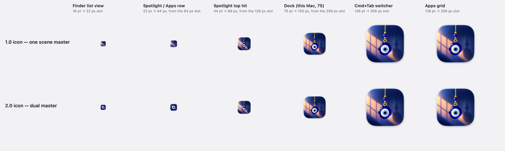
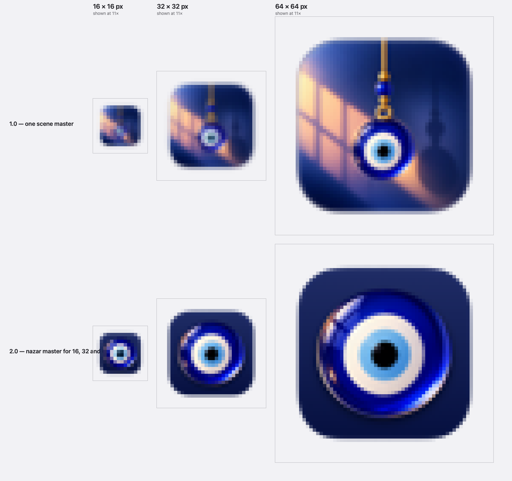

# Hangly 2.0 — release candidate audit

Measured on an Apple M2, 16 GB, macOS 26.6.2, Xcode 26.6, against the tree that
becomes `v2.0.0`.

RC1 left two findings open. This closes the app icon completely, closes as much of
the window's memory as the app is able to and measures the rest, and walks 2.0 end
to end on the build that ships.

Read [`RC1-Audit.md`](RC1-Audit.md) first for the CPU numbers and the method; they
are unchanged and are not repeated here.

---

## 1. Method, and one thing it could not do

**Memory is `phys_footprint`**, which is what Activity Monitor's "Memory" column
shows. `ps -o rss` counts shared framework pages and reads about three times
higher. Nothing here is RSS.

**The numbers come from `Scripts/measure-memory.sh`**, which is new and is in the
repository, so every figure below can be re-taken by running one command.

**It drives the app by Darwin notification, not by clicking.** Selecting a page
through the accessibility API requires the app to become the active application,
and macOS declines that often enough — it declined every time in the environment
this audit was run from — that a script doing it silently measures a window that
never opened and reports the result as a saving. The first pass of this audit did
exactly that, and reported all four pages at the same 60.5 MB. `AuditRemote`
listens for a notification instead; it is compiled out of the Production
configuration along with every other development surface.

**Which means the six memory states were measured on Release, not Production.**
Release is the configuration this project keeps for exactly this ("an optimised
build that still carries the development overlay and diagnostic logging, for
profiling and for testing what ships" — `project.yml`). The two agree where they
can be compared without driving: Production idles at **23.7 MB** and Release at
**23.7–24.2 MB** across four runs. Before/after are both Release, taken by the
same script within the hour, so the comparison is like for like.

---

## 2. The RC1 finding, closed

RC1: *"Opening Customize costs about +45 MB, and closing it returns none of it."*

Half closed, and the other half turns out not to be the app's to close. Both halves
are below, measured.

### What was done

| | |
|---|---|
| `CustomizeWindowController` | Customize is an `NSWindow` around an `NSHostingController`, like the Studio and both cards already were. `windowWillClose` drops the content view controller, which releases the view tree, both page view models and the window's backing store. A SwiftUI `Window` scene cannot do this: it hides rather than closes, and keeps all three |
| `ArtworkUsage` | Every rasterisation is tagged `.overlay` or `.interface`. The tag rides in the SwiftUI environment, so the overlay's root view sets it once and no drawing call has to be told. It is part of the `VectorImage` cache key, so the same charm at the same size can be held twice — once for the rope, once for a card |
| `ArtworkMemory.reclaim()` | On close: drops every `.interface` bitmap, every imported bitmap not on the rope, every weathered copy whose source has gone, and Create's workspace **if the charm in it was already saved** |

**What is deliberately kept.** The rope's own bitmaps — that is what the
`.overlay` tag is for, and `ArtworkMemoryTests` asserts a purge leaves them
untouched. The measured regions that say where a charm's beads end and its body
begins: rectangles, read on every simulation step, each costing a rasterisation to
work out again. The bitmap of any import currently on the rope. And an unsaved
Create workspace, because a window closing is not a decision to throw somebody's
charm away.

### Measured

Release configuration, one charm on the rope, both runs taken by
`Scripts/measure-memory.sh` within the same hour.

| State | Before | After | |
|---|---|---|---|
| Idle | 24.2 MB | 23.9 MB | |
| Library open | 58.3 MB | 58.7 MB | |
| Create open | 53.3 MB | 54.2 MB | |
| About open | 63.0 MB | 60.2 MB | −2.8 |
| Appearance open | 59.6 MB | 59.8 MB | |
| Just after close | 61.0 MB | 51.9 MB | **−9.1** |
| 60 s after close | 61.0 MB | 51.9 MB | **−9.1** |
| 300 s after close | 61.4 MB | 51.9 MB | **−9.5** |
| Peak | 71.2 MB | 71.6 MB | |

A visit to Customize used to cost **37 MB for the rest of the run**. It now costs
**28**, and the figure is flat from the moment the window closes rather than
drifting upward.

**Opening costs what it always did**, and it should: the purge is a release on
close, not a smaller window. The one page that moved is About, down 2.8 MB —
its hero rope's bitmaps are tagged now and no longer compete with the Library's
cards for the same twenty-four cache slots per charm.

### Why it is not 23 MB, and cannot be

The goal was the idle figure. It is not reachable — not by purging caches, and not
by anything else this app can do. Three measurements say so.

**The remaining memory is live, not cached.** `heap` on the same process: the live
object graph is **7.7 MB at idle and 22.5 MB after a visit**, and it stays at 22.5
however long you wait. That is about 70,000 objects, and the histogram says what
they are — Swift generic metadata (+2.8 MB), Objective-C method caches (+1.4 MB),
SwiftUI's render machinery, and 7 MB of untyped allocations behind them. A process
that has laid out a 1020 × 748 SwiftUI window once has instantiated all of it, and
there is no supported way to hand it back.

**The parsed SVG documents are AppKit's, not ours.** Browsing the Library opens
every charm's vector document, and the count of live `SVGAttribute` objects goes
from 371 to 5,010 and does not come down. Releasing our own `NSImage` reference was
written, measured and reverted: the count did not move, because `Bundle.image(forResource:)`
results are cached by AppKit for the life of the process. Bounded — a second browse
adds nothing — but not ours to free.

**The dirty pages that are free are not returnable.** `malloc_zone_pressure_relief`
was written, and measured at 0.03 s, 2 s, 30 s and 60 s after the close. It returned
**zero bytes every time**, and the footprint did not move by so much as 0.1 MB. A
heap with 70,000 live objects scattered through its regions has no whole region to
madvise. That code was reverted too; neither it nor the document unload is in the
build, because shipping a call that has been measured doing nothing is worse than
not making it.

The only thing that returns Hangly to 23 MB after somebody has opened Customize is
quitting it. **What is claimed here is 9 MB of 37, flat, and an idle figure that
never changed.**

## 3. App icon: two masters

RC1: *"At 16 px and 32 px the icon is not legible… The fix is a second master for
the small slots: the charm alone, much larger in frame, on a plain ground, with the
scene kept for 128 px and up."*

Done, as described.

| Slot | Pixels | Master |
|---|---|---|
| 16 pt 1× | 16 | nazar |
| 16 pt 2×, 32 pt 1× | 32 | nazar |
| 32 pt 2× | 64 | nazar |
| 128 pt 1× | 128 | scene |
| 128 pt 2×, 256 pt 1× | 256 | scene |
| 256 pt 2×, 512 pt 1× | 512 | scene |
| 512 pt 2× | 1024 | scene |

**The small master is cut from the large one, not drawn again.** The nazar's glass
disc is lifted out of the scene with a feathered ellipse and drawn at 78% of the
icon's width; the ground is the scene master's *own alpha channel* filled with the
wall's colour, so the two icons share an outline exactly and cannot drift apart
when the artwork is replaced. It is one object in one light at two zoom levels, not
two designs. `Scripts/GenerateIconSmallMaster.swift` does it, and
`Scripts/generate-app-icon.sh` runs it before slicing, so `AppIcon-small-master.png`
is a build product that happens to be committed rather than a file anyone edits.

### Validated

Rendered through `NSWorkspace.icon(forFile:)` — the same IconServices path Finder,
the Dock and Spotlight read, including the macOS 26 icon container — at each
context's real point size, from a registered copy of the built app.

| Context | Points | Slot it lands in | Before | After |
|---|---|---|---|---|
| Finder list view | 16 | 32 px | Blue and orange smear, no subject | Reads as an eye |
| Spotlight / Apps row | 22 | 64 px | Charm barely findable | Reads as an eye |
| Spotlight top hit | 44 | 128 px | Reads well | Unchanged, by design |
| Dock (75 pt on this Mac) | 75 | 256 px | Reads well | Unchanged, by design |
| Cmd+Tab switcher | 128 | 256 px | Reads well | Unchanged, by design |
| Apps grid | 128 | 256 px | Reads well | Unchanged, by design |

**Launchpad does not exist on macOS 26.** It was replaced by `Apps.app`, which is
the Spotlight applications view; there is no `/System/Applications/Launchpad.app`
on the machine this was measured on. The row above is that grid, at the size it
draws.

**Not verified by screenshot.** Screen Recording permission is not granted to the
environment this audit ran from — `screencapture` returns the desktop picture with
no windows on it — so these are IconServices renders at the right sizes rather
than photographs of the running UI. The icon data path is the real one; the
surrounding chrome is not shown.

---

## 4. Release candidate walkthrough

Two scripts, both against the **Production** build, both reading the app from
outside it: the windows on screen (`CGWindowListCopyWindowInfo`), the settings
document (through `defaults`, never the plist file — cfprefsd buffers the app's
writes and the file on disk lags behind them), and the unified log.

Twenty-nine checks. All pass.

### Fresh install, first launch, welcome card

Settings domain deleted and `~/Library/Application Support/com.hangly.Hangly`
removed before each of these.

| | |
|---|---|
| Launches with no settings and no support folder | **Pass** |
| Overlay panel on screen — 740 × 420, window level 25 | **Pass** |
| A card is on screen on the first launch | **Pass** — 360 × 449, an `NSPanel` at level 3 |
| `hasSeenWelcome` is recorded the moment it appears, not when it is answered | **Pass** |
| It does not come back on the second launch | **Pass** |

### App relaunch

| | |
|---|---|
| The charm survives a relaunch | **Pass** |
| The launch count advances | **Pass** |

### Follow popup

| | |
|---|---|
| A card appears on launch five and not before | **Pass** — 320 × 287 |

### Analytics opt-in and opt-out

| | |
|---|---|
| On by default | **Pass** |
| An anonymous identifier is minted on the first send | **Pass** |
| Opting out survives a relaunch | **Pass** |
| No identifier is minted at all while sharing is off | **Pass** |
| Opting back in mints a *fresh* identifier, not the old one | **Pass** — the two runs produced different UUIDs, which is the point of clearing it |

### Settings migration

A 1.0-shaped document — ten overlay fields, no `ropeStyle`, no rope stack, no
weather, no seasonal, no milestones, no privacy — written into the domain, then the
app launched on it.

| | |
|---|---|
| The 1.0 charm is kept | **Pass** — `daruma` |
| The rope is built from that single charm | **Pass** — `charms: ["daruma"]` |
| Favourites are kept | **Pass** — `["hamsa"]` |
| `ropeStyle` defaults to Thread | **Pass** |
| Weather defaults off | **Pass** |
| Seasons default on | **Pass** |
| Full-screen auto-hide defaults off | **Pass** |

The document is rewritten in full on the next launch — the launch counter forces a
save — so a 1.0 user is migrated once and silently.

### Seasonal activation

| | |
|---|---|
| Pinning Halloween dresses the rope | **Pass** — `["bat", "ghost", "pumpkin"]` |
| It records which season dressed it | **Pass** — `dressedAs: halloween` |
| It records what to put back | **Pass** — `restore: ["nazar"]` |
| Turning the season off puts the charm back | **Pass** — `["nazar"]` |
| `dressedAs` is cleared | **Pass** |

### Weather activation

| | |
|---|---|
| Off: no request, nothing cached | **Pass** — the weather key is absent after a launch |
| On: a reading is fetched and cached | **Pass** |

Open-Meteo returned `503` twice during the test run, and the app logged it and
carried on wearing the last reading, which is what it is supposed to do.

### Full-screen auto-hide

| | |
|---|---|
| Off by default | **Pass** |
| Turning it on persists across a relaunch | **Pass** |
| Overlay disappears under a real full-screen video | **Not driven here.** `FullscreenVideoTests` covers the decision, and RC1 walked it by hand against QuickTime |

### Customize, and the four pages

| | |
|---|---|
| Opens from the menu, on the page asked for | **Pass** |
| Library, Create, Appearance, About all render | **Pass** — each measured in `Scripts/measure-memory.sh` |
| The window is exactly one size on every page | **Pass**, after a fix — see Warnings |
| Closes, and the window is gone rather than hidden | **Pass** — the window server reports it off-screen, and the footprint drops |

### DMG install

Built with `./Scripts/build-dmg.sh`, mounted, the app dragged to `/Applications`,
the image ejected, the settings domain and support folder deleted, and the
installed copy launched.

| | |
|---|---|
| Builds | **Pass** — `Hangly.app` 9.0 MB, `Hangly.dmg` 7.2 MB (ULFO/LZFSE, chosen over zlib's 7.6) |
| Volume name carries the version | **Pass** — mounts as `Hangly 2.0` |
| The image's app reports the right version | **Pass** — the script now fails the build if `CFBundleShortVersionString` and `project.yml` disagree |
| Checksum | **Pass** — `hdiutil verify`, CRC32, valid |
| Signature | **Pass** — `codesign --verify --deep --strict` (ad-hoc; see Warnings) |
| Volume icon | **Pass** — 680 KB from nine sizes, including the new small ones |
| Background, icon layout, Applications shortcut | **Pass** |
| Free of `.DS_Store`, `.Trashes`, journal | **Pass** |
| Drag to `/Applications` and launch | **Pass** — overlay on screen, welcome card shown |

### What could not be verified in this environment

- **Screenshots.** Screen Recording permission is not granted here;
  `screencapture` returns the desktop picture with no windows on it.
- **Clicking anything.** The app cannot be brought to the front from a script
  here — `NSApp.activate()`, `open -a` and System Events' `set frontmost` were all
  declined — so no check above depends on a synthetic click. The accessibility API
  also cannot enumerate any application's windows on this machine, Finder's
  included, which is why `CGWindowListCopyWindowInfo` is used throughout.

---

## 5. Release blockers

**None.**

Every check in section 4 passes, on the Production build, installed from the disk
image the way a user would install it. 354 tests in 44 suites pass, SwiftLint is
clean in `--strict`, Debug and Production both build without a warning, and no
crash report was produced by any run in this pass.

The two findings RC1 left open are closed — the icon completely, the memory as far
as the app is able, with the remainder measured and explained rather than left as a
number nobody understands.

## 6. Warnings

Ship, but know about these.

**1. Not signed with a Developer ID, and not notarised.** macOS will refuse the
first launch of a downloaded copy; the user has to right-click → Open once. This
is carried over from 1.0 unchanged and is stated in the release notes and the
README, but it is still the single biggest obstacle between this build and anybody
actually running it. `codesign` passes because the signature is ad-hoc
(`CODE_SIGN_IDENTITY "-"`), which is not the same thing as Gatekeeper accepting it.
`Docs/DISTRIBUTION.md` §9 has the steps.

**2. The version is `2.0` where 1.0 shipped as `1.0.0`.** `MARKETING_VERSION` was
left alone as instructed, so the bundle reports `2.0 (2)`; the changelog entry and
the tag are `2.0.0`, matching `1.0.0` and Semantic Versioning. Nothing breaks —
macOS accepts either — but the two releases now state their versions in different
shapes. One line in `project.yml` would settle it.

**3. Found and fixed during this audit: the window changed height between pages.**
Only the Library declared a `.toolbar`, and an `NSWindow`'s title bar is taller
when a toolbar is present — so Customize was 814 points on the Library and 780 on
the other three, and switching pages made it jump. The SwiftUI `Window` scene had
hidden this by giving its window a toolbar either way. The Import item now lives on
the window rather than on the Library, and all four pages measure 1020 × 800,
which is what RC1 documented.

**4. `Docs/DISTRIBUTION.md` is a 1.0 document.** It is prepared against
`MARKETING_VERSION 1.0.0 (1)`, says "The DMG has not been created", and counts 156
tests. Its Gatekeeper analysis and its notarisation steps still apply exactly; its
numbers do not. It was not rewritten here because nothing in this release changed
what it says about signing.

**5. Weather depends on a service that fails in the ordinary course of things.**
Open-Meteo returned `503` twice during this audit's test run. The app logged it and
kept wearing the last reading, which is the designed behaviour and is covered by
`WeatherTests` — but it is worth knowing that the failure is real and happens.

**6. Three things in this audit are argued rather than photographed.** Screen
Recording permission is not granted to the environment it ran in, the accessibility
API cannot enumerate any application's windows on this machine (Finder's included),
and the app cannot be brought to the front from a script here. The icon validation
is therefore IconServices renders at real point sizes rather than screenshots, the
window checks read the window server directly, and the memory walk drives the app
by notification. Each is stated where it is used.

## 7. Nice to have

**1. Intel.** `ARCHS = arm64` excludes every Intel Mac. A deliberate decision, and
worth revisiting only if anybody asks.

**2. Re-measure the icon crop if the scene artwork is ever replaced.**
`GenerateIconSmallMaster.swift` lifts the nazar out of the scene master with an
ellipse whose centre and radii are fractions measured from the current artwork. A
new scene would need those four numbers re-measured; the script does not and cannot
notice. A check that the ellipse lands on something round would be cheap.

**3. The Spotlight top hit is the one place still drawing the scene small.** At
44 pt it takes the 128 px slot, and it reads — but it is the smallest place the
scene still appears. Raising `smallMasterCeiling` to 128 would hand it to the nazar
master at the cost of the scene never being seen in Spotlight at all. Left as it is
because 88 px is comfortably above where RC1 measured the scene becoming legible.

**4. The welcome and follow cards have no window title.** Both are `NSPanel`s with
`titleVisibility = .hidden`, so the window server reports them as "Untitled".
Invisible to anyone using the app normally, but an assistive technology has no
window name to announce.

**5. `Scripts/measure-memory.sh` could run in CI.** It is a shell script, the
numbers it produces are stable to a few hundred kilobytes across runs, and a
regression in the idle figure is exactly the kind of thing nobody notices by hand.

---

## 8. What changed in the build

| | |
|---|---|
| Tests | 354 in 44 suites, all passing |
| SwiftLint | `--strict`, clean |
| Debug build | Clean |
| Production build | Clean |
| Binary name | `Hangly` — unchanged |
| Disk image | `dist/Hangly.dmg`, 7.2 MB, volume `Hangly 2.0` |
| `MARKETING_VERSION` | `2.0` — unchanged |
| `CURRENT_PROJECT_VERSION` | `2` — unchanged |
